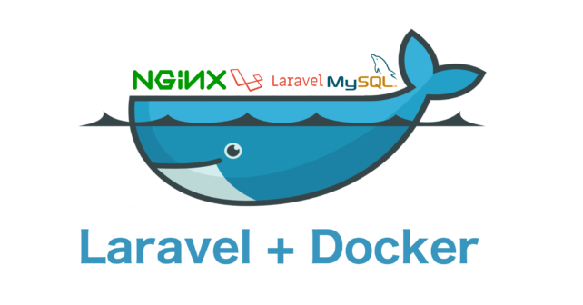

#  Dockerize Laravel App

Simple steps to Dockerize your **Laravel** app

**Laravel php Docker nginx MySQL phpmyadmin**

    .
    ├── dockerfiles
    │   ├── nginx
    │   │   └── default.conf  
    |   └── nginx.dockerfile
    |   └── php.dockerfile
    ├── mysql
    ├── src
    └── docker-compose.yml

    3 directories, 4 files

#### Development Stuffs:

      

#### Installation:

>First clone this repository for command: 
<code>$ git clone https://github.com/JoneCoder/dockerize-laravel.git</code>

>Second change the directory this command: 
<code>$ cd dockerize-laravel/</code>

>Make mysql directory this command: 
<code>$ mkdir mysql</code>

>Build & run project on detach mode with "Docker" this command: 
<code>$ docker-compose up -d --build</code>

>Now change the directory this command: 
<code>$ cd src/</code>

>Than copy the .env.example file to .env flowing command: 
<code>$ cp .env.example .env</code>

>Now update composer for install laravel vendor: 
<code>$ docker-compose run --rm composer install</code>

>If composer installing done than you generate application key for this command: 
<code>$ docker-compose run --rm artisan key:generate</code>

>Migrate a database run the flowing command: 
<code>$ docker-compose run --rm artisan migrate</code>

>Install and run npm this command: 
<code>$ docker-compose run --rm npm install && npm run dev</code>

>If you done all stuffs than open your favorite browser hit localhost port 8082: 
<code>http://localhost:8080</code>

>Enjoy this service.